# imfine 当前实现工作流流程图

生成时间：2026-05-06

本文档基于当前源码实现整理，描述 imfine 已存在的工作流。流程图使用 Mermaid，重点表达 Orchestrator、runtime action、model Agent handoff 和证据 gate 的实际关系。

## 图例

流程图中带颜色的节点表示一次 workflow 的“最终状态”或“显式停顿状态”：

- 绿色：已完成，当前 workflow 成功结束，或进入下一个主链路。
- 黄色：等待模型、等待依赖或等待外部条件，当前 runtime 不继续推进。
- 红色：阻塞，当前 workflow 不会继续执行后续 action，需要 Orchestrator 恢复、模型返工或外部条件修复。
- 蓝色：继续进入其他 workflow，不是失败状态。
- 灰色：内部调试或非用户主入口路径。

## 1. 用户主入口工作流

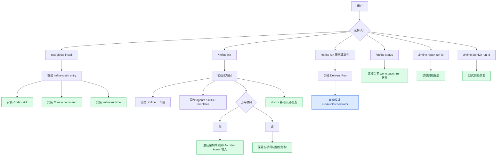

## 2. Delivery Run 创建工作流

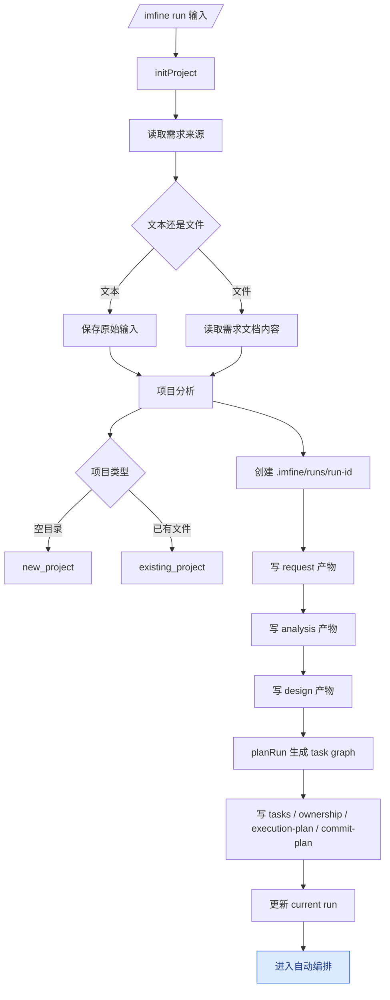

## 3. 自动编排总工作流

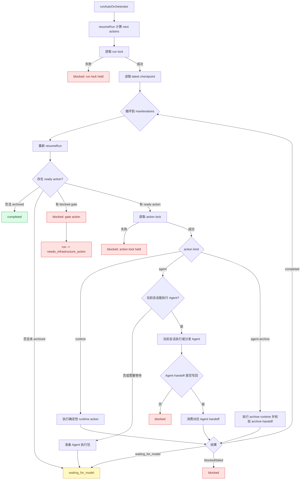

状态说明：

- `completed`：当前 auto loop 已经没有待执行 action，且 run 已归档。
- `waiting_for_model`：runtime 已准备好 Agent 执行包，但当前会话还没有完成对应 Agent 工作，或缺少模型 handoff / 可继续推进的模型结果。
- `blocked`：当前 action 不适合继续执行，原因可能是 gate、lock、handoff 或模型执行失败。
- `run lock held`：同一个 run 已有另一个自动编排进程在推进，本次调用不执行任何 action，避免重复 commit、push 或写坏 run 状态。
- `action lock held`：某个 action 正在执行，本次调用不重复执行该 action。
- `needs_infrastructure_action`：doctor 或 gate 发现基础设施问题，runtime 已写 evidence，等待修复或后续恢复。

## 4. Orchestrator Action 生成工作流

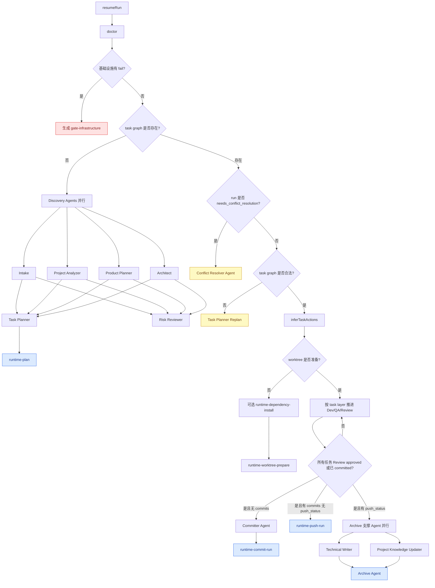

状态说明：

- `gate-infrastructure`：基础设施检查失败时生成的阻塞 gate，通常来自 git、remote、push 权限、包管理器或测试命令问题。
- `Conflict Resolver Agent`：run 已进入 `needs_conflict_resolution`，下一步应由冲突解决 Agent 处理。
- `Task Planner Replan`：task graph 校验失败时进入重新规划，不继续执行不可靠任务图。
- 蓝色节点表示进入其他 workflow，例如 runtime plan、commit、push 或 archive。

## 5. 任务执行 / QA / Review / 返工工作流

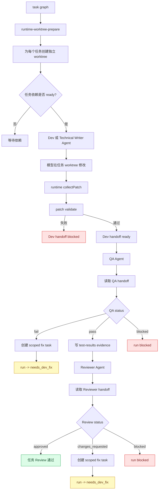

状态说明：

- `Dev handoff blocked`：patch 收集或校验失败，不能进入 QA。
- `needs_dev_fix`：QA fail 或 Review changes_requested 后，系统已生成 scoped fix task；后续由 Orchestrator 继续调度 Dev / QA / Review，不依赖固定重试次数的人为阻塞。
- `run blocked`：QA 或 Review 明确 blocked，当前任务链路停止，等待模型或外部条件解决阻塞点。
- `任务 Review 通过`：该任务满足 commit 前的 QA / Review gate。

## 6. Risk Reviewer 工作流

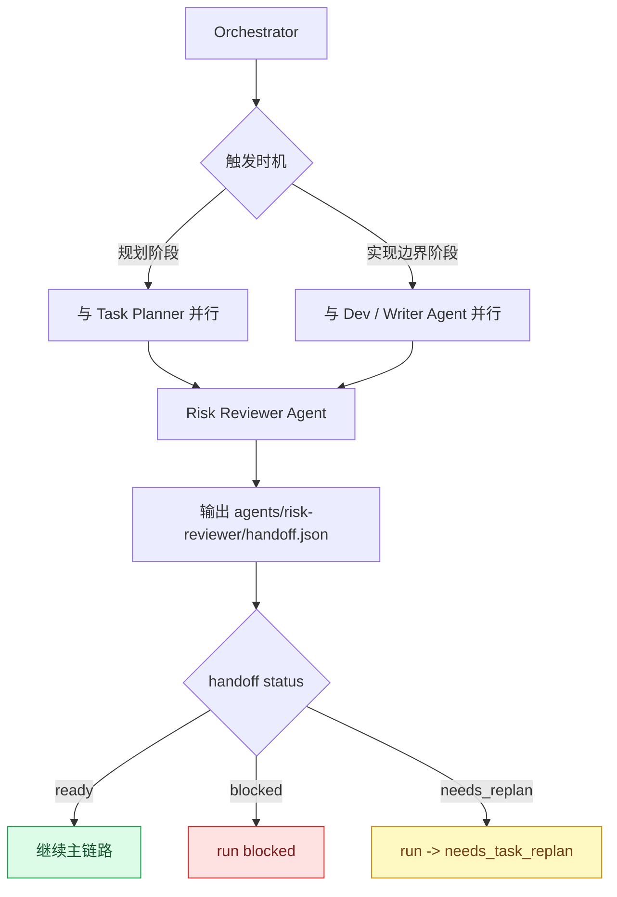

状态说明：

- `ready`：Risk Reviewer 认为当前风险可接受，主链路继续。
- `blocked`：风险不可接受，run 阻塞，等待模型或外部条件解决。
- `needs_task_replan`：Risk Reviewer 要求重新规划任务边界或执行计划，后续进入 Task Planner replan。

## 7. 冲突解决工作流

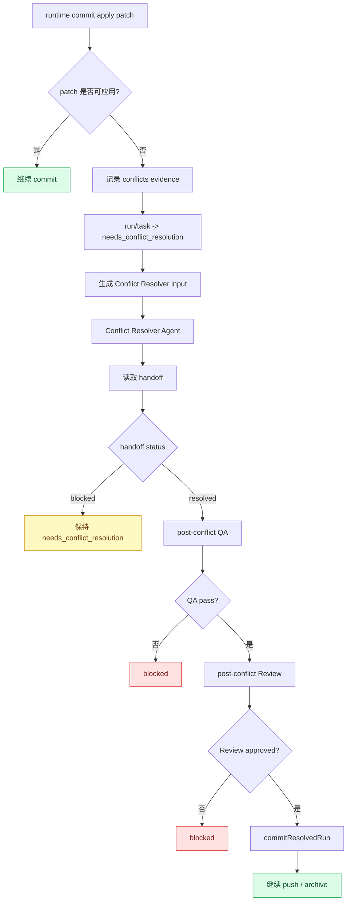

状态说明：

- `needs_conflict_resolution`：runtime commit 阶段 patch apply 失败，已生成 Conflict Resolver input 和 conflicts evidence。
- `保持 needs_conflict_resolution`：Conflict Resolver handoff 为 blocked，run 保持冲突待解决状态。
- `post-conflict QA / Review`：Conflict Resolver handoff 为 resolved 后，runtime 会自动执行冲突后的 QA 和 Review gate。
- `继续 push / archive`：resolved commit 成功后，回到后续 push / archive 主链路。

## 8. Commit / Push 工作流

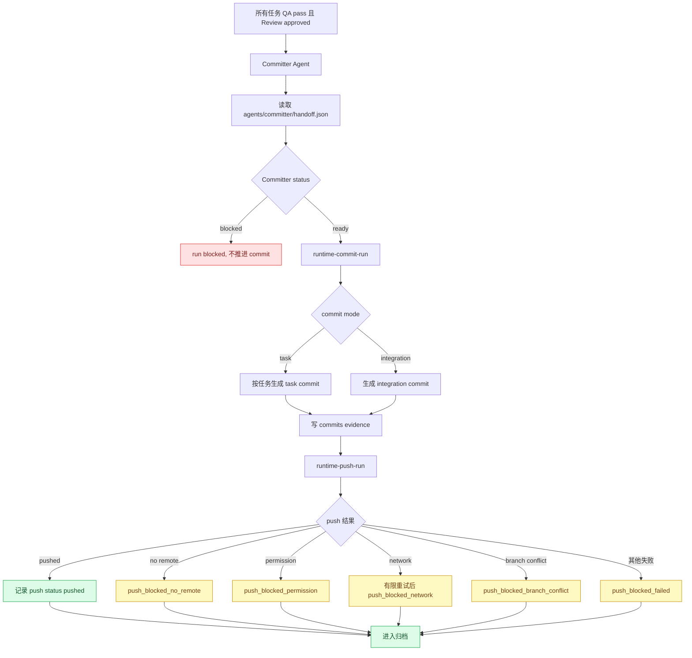

状态说明：

- `run blocked, 不推进 commit`：Committer handoff 为 blocked，runtime 不执行 commit。
- `push_blocked_no_remote`：没有 `origin` remote。
- `push_blocked_permission`：remote 或凭证权限不足。
- `push_blocked_network`：网络问题，runtime 有有限重试，仍失败后记录该状态。
- `push_blocked_branch_conflict`：远端分支冲突，不能盲目覆盖。
- `push_blocked_failed`：未能归入明确分类的 push 失败。
- `push_blocked_*` 不一定阻止归档；归档报告会记录本地 commit、目标分支和用户后续动作。

## 9. 归档和长期知识更新工作流

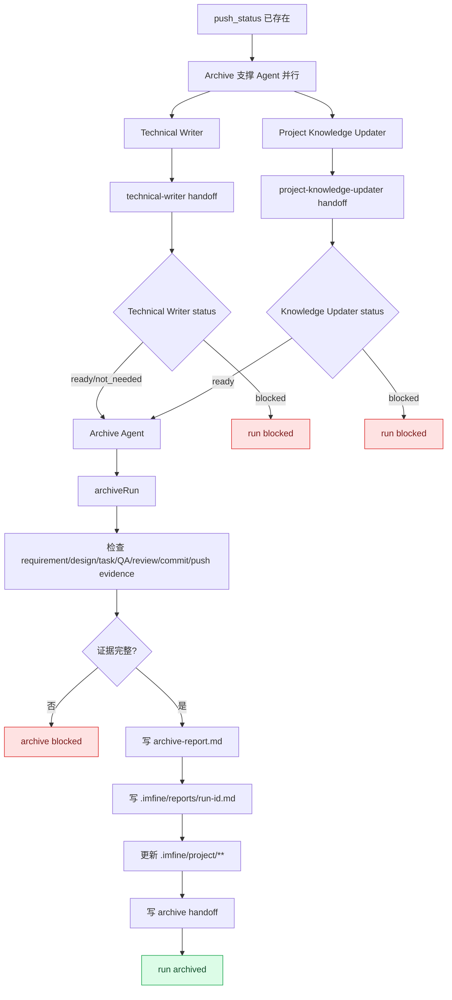

状态说明：

- `Technical Writer blocked`：归档前文档整理不可继续，Archive 不应直接消费不完整文档结论。
- `Project Knowledge Updater blocked`：项目长期知识更新不可确认，Archive 不应写入未验证知识。
- `archive blocked`：Archive evidence 不完整，归档报告会记录缺失项，但不会把未验证结论沉淀到长期知识库。
- `run archived`：归档完成，已写 `.imfine/reports/<run-id>.md` 并更新 `.imfine/project/**`。

## 10. 新项目工作流

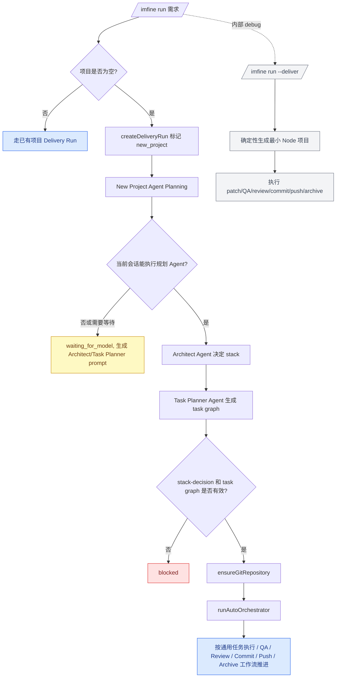

状态说明：

- `waiting_for_model`：新项目主路径需要当前大模型会话执行 Architect / Task Planner Agent 来决定 stack 和 task graph；如果暂未执行，只生成 prompt 包，不由 runtime 硬编码选择技术栈。
- `blocked`：模型输出的 `stack-decision` 或 `task-graph` 不合法，不能继续生成项目。
- `--deliver`：内部 debug 路径，会确定性生成最小 Node 项目；它不是用户主 harness 工作流。

## 11. 恢复和等待工作流

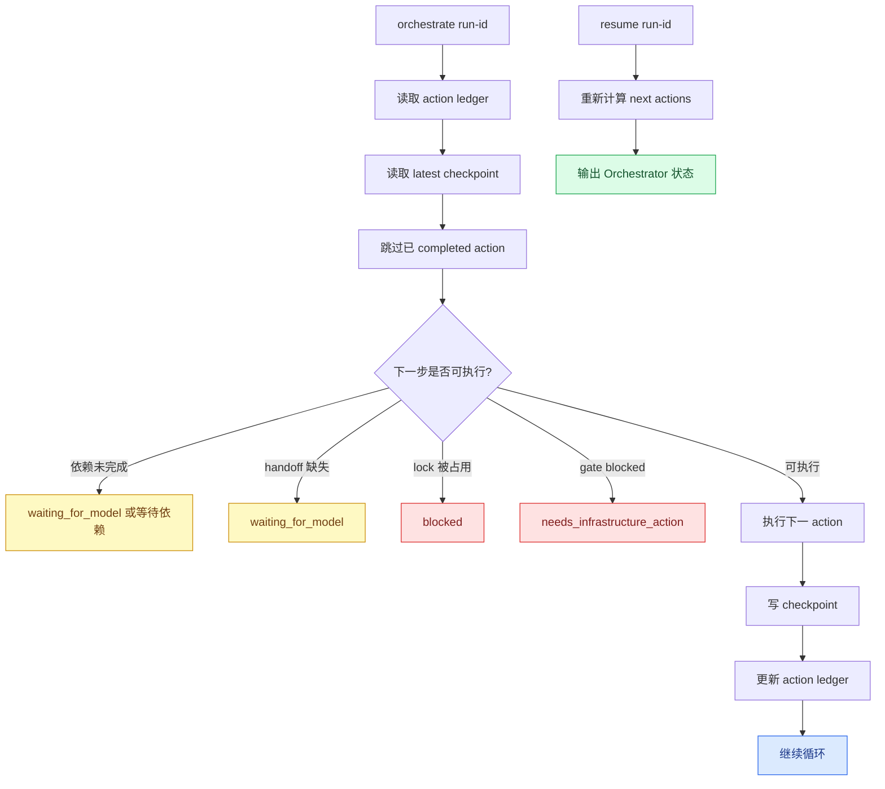

状态说明：

- `waiting_for_model 或等待依赖`：当前 action 还缺少模型 handoff、当前会话的 Agent 执行结果或上游依赖 evidence。
- `lock 被占用`：run 或 action 正在被其他编排进程执行，本次调用不重复执行。
- `needs_infrastructure_action`：基础设施 gate blocked，等待修复后再继续 orchestrate。
- `resume run-id`：当前实现是重新计算并输出 next actions；真正自动推进恢复链路的是 `orchestrate run-id` 或 `/imfine run` 内部调用的 auto orchestrator。

## 12. 工作流边界说明

- 用户主入口聚焦 `/imfine init`、`/imfine run`、`/imfine status`、`/imfine report`、`/imfine archive`。
- `plan`、`worktree`、`patch`、`verify`、`review`、`commit`、`push`、`agents prepare/execute` 等命令是 runtime 内部或调试恢复入口。
- 当前 `/imfine run` 默认进入自动编排；当遇到 Agent action 时，runtime 准备 prompt 包，当前 Codex / Claude 大模型会话负责执行或分发 Agent 工作并写回 handoff。
- `resume <run-id>` 当前重新计算 Orchestrator next actions；真正自动执行恢复链路的是 `orchestrate <run-id>` 或 `/imfine run` 内部调用的 auto orchestrator。
- 新项目主路径依赖模型 Agent 做 stack 和 task graph 决策；`--deliver` 是内部 debug 路径，包含确定性最小 Node 项目生成逻辑。
